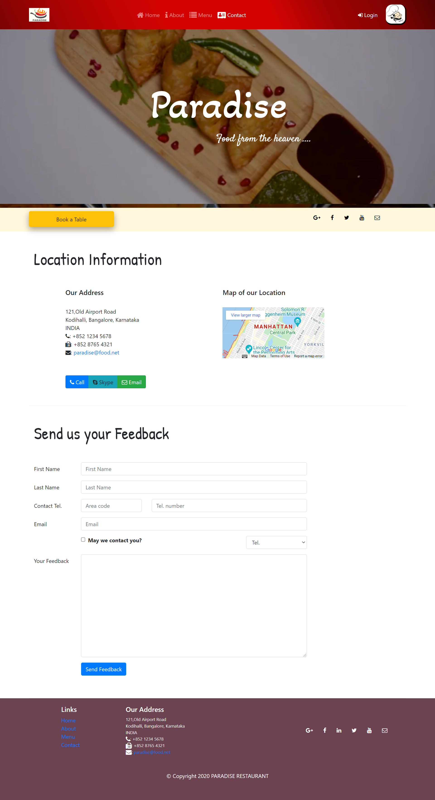
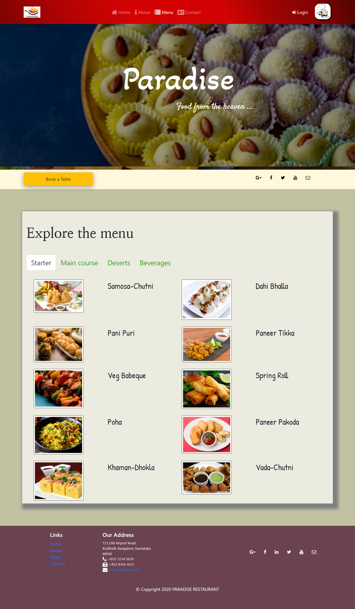
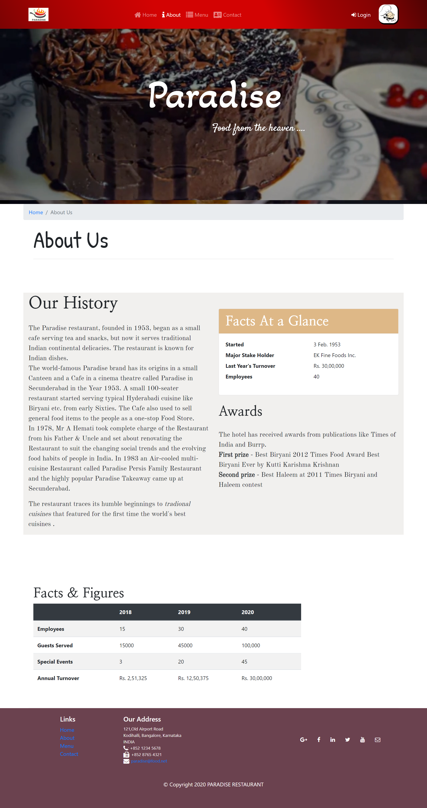

# ✨ Paradise-Restaurant Website  ✨

This is a web based application developed for a restaurant named PARADISE.

### This web based restaurant application has been developed for the accomplishment of Future Ready Talent Internship program launched by Microsoft, Future Skills Prime, Quess, Github and EY.

**Project Link** - https://paradise-restaurant.azurewebsites.net

**Demo Video** -  https://www.youtube.com/watch?v=_pKWyCiRrcg&t=2s

## Features and Functionalities 😃

- Interactive and responsive UI.
- Has many graphical and visual innovative effects.
- Have an aesthetically pleasing visual design and architecture.
- Has collection of many web pages including Home, About Us, Contact, Menu, Chef Staff pages etc.
- User is able to book a table through the website.
- Included the feedback Survey form to increase the scope of improvement 

## Screenshots 📸
### Home page -   

### Team page -

### Contact page -

### Menu Page -

### About Us Page -

## Tech Stack 💻

- [Azure(Hosting)](https://azure.microsoft.com/en-in/features/azure-portal/)
- HTML
- CSS
- Bootstrap
- JavaScript
